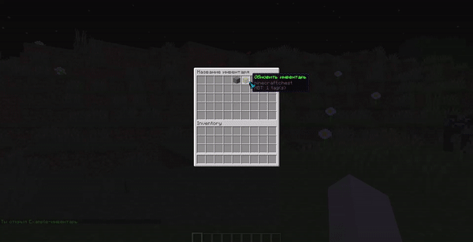
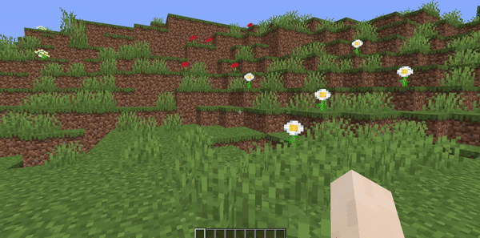
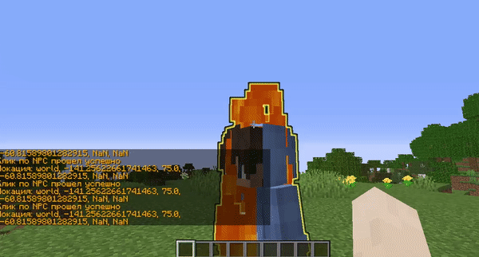
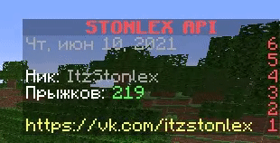

# StonlexAPI

***
## Обратная связь
* **[Discord chat](https://discord.gg/GmT9pUy8af)**
* **[ВКонтакте](https://vk.com/itzstonlex)**

***

## Основная информация
В основном данная апи предназначена для написания плагинов, различных систем и игр в сфере Minecraft.

Она несет в себе множество функций, таких, как управление базой данных, **~~Game API~~**, **ProtocolLib API**, множество удобных **утилит**, **адаптеров**, и даже **мультиязычность** (локализация сообщений).

***

## Bukkit-API


### `Команды:`

Теперь создавать, регистрировать и использовать команды стало куда проще! В данной разработке доступна реализации как для мелких, так и для больших команд, которые содержат огромное количество данных, алиасов и подкоманд.

Для начала создадим обычную команду при помощи `BaseCommand`, использовать которую может **ТОЛЬКО** игрок:
```java
public class ExamplePlayerCommand
        extends BaseCommand<Player> {

    public ExamplePlayerCommand() {
        super("test", "testing");
    }

    @Override
    protected void onExecute(Player player, String[] args) {
        player.sendMessage(ChatColor.GREEN + "Вы успешно выполнили команду /player");
    }

}
```

Ранее я говорил о создании больших команд, которые помогут сэкономить множество проверок и большого количества кода. Речь шла о `BaseMegaCommand`:
```java
public class ExamplePlayerCommand
        extends BaseMegaCommand<Player> {

    public ExamplePlayerCommand() {
        super("megatest", "megatesting");
    }

    @Override
    protected void onUsage(Player player) {
        player.sendMessage("Список доступных подкоманд:");
        player.sendMessage(" - /megatest online");
        player.sendMessage(" - /megatest broadcast <сообщение>");
    }

    @CommandArgument(aliases = "players")
    protected void online(Player player, String[] args) {
        int playersCount = Bukkit.getOnlinePlayers().size();

        String onlinePlayers = Joiner.on(", ").join(Bukkit.getOnlinePlayers().stream().map(Player::getDisplayName).collect(Collectors.toSet()));

        player.sendMessage(String.format("Сейчас на сервере (%s): %s", playersCount, onlinePlayers));
    }

    @CommandArgument
    protected void broadcast(Player player, String[] args) {

        String broadcastMessage = ChatColor.translateAlternateColorCodes('&', Joiner.on(" ").join(args));

        for (Player onlinePlayer : Bukkit.getOnlinePlayers()) {
            onlinePlayer.sendMessage("MegaTest Broadcast > " + broadcastMessage);
        }
    }

}
```
Каждый метод - это отдельная подкоманда, а аннотация `@CommandArgument` обозначает нужный метод подкомандой и избавит Вас от костылей, duplicated-кода, создав для определенной подкоманды указанные алиасы.

Весь менеджмент над Bukkit API происходит через один класс - `ru.stonlex.bukkit.StonlexBukkitApi`

Исходя из этого, регистрация команд происходит тоже через этот класс:
```javascript
StonlexBukkitApi.registerCommand(new ExamplePlayerCommand());
```

***
### `Конфигурации:`
Для начала попробуем создать обычную конфигурацию, которая ничего не загружает и не воспроизводит на основе `ru.stonlex.bukkit.configuration.BaseConfiguration`:
```java
public class TestConfiguration
        extends BaseConfiguration {

    public TestConfiguration(@NonNull Plugin plugin) {
        super(plugin, "messages.yml");
    }

    @Override
    protected void onInstall(@NonNull FileConfiguration fileConfiguration) {
        // ...
    }

}
```

Теперь можно ее доделать так, чтобы это было похоже на конфигурацию, которая хранит в себе сообщения для локализации Вашего плагина:
```java
public class TestConfiguration
        extends BaseConfiguration {

    protected final Map<String, String> messagesCacheMap = new HashMap<>();

    public TestConfiguration(@NonNull Plugin plugin) {
        super(plugin, "messages.yml");
    }

    @Override
    protected void onInstall(@NonNull FileConfiguration fileConfiguration) {
        for (String messageKey : fileConfiguration.getConfigurationSection("Messages").getKeys(false)) {

            String messageText = ChatColor.translateAlternateColorCodes('&', fileConfiguration.getString("Messages.".concat(messageKey)));
            messagesCacheMap.put(messageKey, messageText);
        }
    }
}
```

Хранить и использовать конфигурацию можно хоть как и хоть где, но мы так до сих пор и не уточнили, как ее создавать, инициализировать, и в прицнипе работать с ней.
```java
@Override
public void onEnable() {
        TestConfiguration configuration = new TestConfiguration(this);
        configuration.createIfNotExists();
}
```
В данном куске кода мы создали (или скопировали из ресурсов плагина) конфигурацию, инициализировали в ней данные, и можем спокойно пользоваться!
***

### `Голограммы:`
Неужели **HolographicDisplays** теперь окончательно устарел?

По сути, так оно и есть, потому что **StonlexAPI** содержит в себе даже **API** для удобного создания голограмм с различными анимациями, обновлениями и типами строк.

Для начала попробуем понять, как вообще создаются голограммы:
```java
ProtocolHolographic protocolHolographic
        = StonlexBukkitApi.createSimpleHolographic(location);
```

Текстовые строки:
```java
protocolHolographic.addTextLine(ChatColor.AQUA + "Этот клубничный пудинг был просто великолепен!");
```

Пустые строчки:
```java
protocolHolographic.addEmptyLine();
```

Кликабельные строки:
```java
// Создание кликабельных голограмм
Consumer<Player> playerConsumer = player -> { //player = игрок, который кликнул

    player.sendMessage(ChatColor.GOLD + "Клик по голограмме прошел успешно!");
    player.sendMessage(ChatColor.GOLD + "Локация: " + LocationUtil.locationToString(protocolHolographic.getLocation()));
};

// Добавление строк в голограмму
protocolHolographic.addClickLine(ChatColor.YELLOW + "Разработчик данной API", playerConsumer);
protocolHolographic.addClickLine(ChatColor.GREEN + "https://vk.com/itzstonlex", playerConsumer);
```

Строчки с предметами:
```java
protocolHolographic.addDropLine(new ItemStack(Material.APPLE));
```

И даже строчки с головами по нику или текстуре:
```java
protocolHolographic.addSkullLine("ItzStonlex", false);
protocolHolographic.addSkullLine("eyJ0ZXh0dXJlcyI6eyJTS0lOIjp7InVybCI6Imh0dHA6Ly90ZXh0dXJlcy5taW5lY3JhZnQubmV0L3RleHR1cmUvNDUyOGVkNDU4MDI0MDBmNDY1YjVjNGUzYTZiN2E5ZjJiNmE1YjNkNDc4YjZmZDg0OTI1Y2M1ZDk4ODM5MWM3ZCJ9fX0=", false);
```

Так как голограмма является пакетной, то ей можно манипулировать как угодно, пример тому является функционал спавна и удаления этих голограм, взаимодействуя с игроками сервера:
```java
protocolHolographic.addReceivers(receiver); //заспавнить только для одного игрока
```
```java
protocolHolographic.removeReceivers(receiver); // удалить только для одного игрока
```
```java
protocolHolographic.addViewers(receiver); // показать только для одного игрока
```
```java
protocolHolographic.removeViewers(receiver); // скрыть только для одного игрока
```
```java
protocolHolographic.spawn(); // заспавнить для всех игроков, и даже для тех, кто еще не зашел
```
```java
protocolHolographic.remove(); // удалить голограмму как для всех, так и прекратить спавн для новых игроков
```


***
### `Кликабельные инвентари:`

Такая заезжая, но такая актуальная тема... Многим даже сейчас сложно писать кликабельные, мультистраничные, автообновляющиеся, или с какими-то другими фишками, но **GUI**-интерфейсы

Рассмотрим вариант создания самого обычного инвентаря при помощи `ru.stonlex.bukkit.inventory.impl.BaseSimpleInventory`:

```java
public class ExampleSimpleGUI
        extends BaseSimpleInventory {

    public ExampleSimpleGUI() {
        super(5, "Название инвентаря");
    }

    @Override
    public void drawInventory(Player player) {
        // ...
    }

}
```

Теперь добавим парочку кликабельных предметов в слоты 5 и 6.                                 
**Важно знать**, что подсчет слотов в данной API начинается **не с 0, а с 1**

```java
public class ExampleSimpleGUI
        extends BaseSimpleInventory {

    public ExampleSimpleGUI() {
        super(5, "Название инвентаря");
    }

    @Override
    public void drawInventory(Player player) {
        addItem(5, ItemUtil.newBuilder(Material.STONE)
                        .setName("§eБаклажан")
                        .build(),

                (player1, event) -> {

                    player.sendMessage("§eКлик прошел, закрываю инвентарь");
                    player.closeInventory();
                });

        addItem(6, ItemUtil.newBuilder(Material.CHEST)
                        .setName("§aОбновить инвентарь")
                        .build(),

                (player1, event) -> updateInventory(player));
    }

}
```

Также нельзя не вставить то, что инвентари поддерживают внедрение своих обработчиков событий:
```java
    public ExampleSimpleGUI() {
        super(5, "Название инвентаря");

        // Обработчик открытия/закрытия инвентаря
        addHandler(BaseInventoryDisplayableHandler.class, new BaseInventoryDisplayableHandler() {

            @Override
            public void onOpen(@NonNull Player player) {
                player.sendMessage("§aТы открыл Example-инвентарь");
            }

            @Override
            public void onClose(@NonNull Player player) {
                player.sendMessage("§cТы закрыл Example-инвентарь");
            }
        });
    }
    
```




На данном моменте можно было бы и закончить список функционала инвентарей, однако, этим они не ограничиваются.

Помимо обычных инвентарей были написаны и мультистраничные, которые поддерживают удобную разметку предметов на каждой странице!

Для начала попробуем создать обычный страничный инвентарь, наследуя `ru.stonlex.bukkit.inventory.impl.BasePaginatedInventory`:

```java
public class ExamplePaginatedGUI
        extends BasePaginatedInventory {

    public ExamplePaginatedGUI() {
        super(5, "Название инвентаря");
    }

    @Override
    public void drawInventory(Player player) {
        // ...
    }

}
```

Затем выставим разметку страничных предметов в виде квадрата (одного из шаблонных разметок):
```java
public class ExamplePaginatedGUI
        extends BasePaginatedInventory {

    public ExamplePaginatedGUI() {
        super(5, "Название инвентаря");
    }

    @Override
    public void drawInventory(Player player) {
        setItemMarkup(new BaseInventoryBlockMarkup(inventoryRows));

        // ...
    }

}
```

Теперь можно и добавить предметы в разметку страницы:

**P.S:** API автоматически рассортирует их по необходимым слотам и страницам
```java
public class ExamplePaginatedGUI
        extends BasePaginatedInventory {

    public ExamplePaginatedGUI() {
        super(5, "Название инвентаря");
    }

    @Override
    public void drawInventory(Player player) {
        setItemMarkup(new BaseInventoryBlockMarkup(inventoryRows));

        addItemToMarkup(new ItemStack(Material.STONE), (player1, event) -> player.closeInventory());
        addItemToMarkup(new ItemStack(Material.DIAMOND), (player1, event) -> player.closeInventory());
        addItemToMarkup(new ItemStack(Material.BANNER), (player1, event) -> player.closeInventory());
        addItemToMarkup(new ItemStack(Material.BARRIER), (player1, event) -> player.closeInventory());
        addItemToMarkup(new ItemStack(Material.CACTUS), (player1, event) -> player.closeInventory());

        //...
    }

}
```

После чего уже можно добавлять свои различные предметы, которые будут независимо отображаться на всех страницах инвентаря.

В моем случае выставлен предмет без клика, который показывает текущую страницу, на которой находится игрок:
```java
public class ExamplePaginatedGUI
        extends BasePaginatedInventory {

    public ExamplePaginatedGUI() {
        super(5, "Название инвентаря");
    }

    @Override
    public void drawInventory(Player player) {
        setItemMarkup(new BaseInventoryBlockMarkup(inventoryRows));

        addItemToMarkup(new ItemStack(Material.STONE), (player1, event) -> player.closeInventory());
        addItemToMarkup(new ItemStack(Material.DIAMOND), (player1, event) -> player.closeInventory());
        addItemToMarkup(new ItemStack(Material.BANNER), (player1, event) -> player.closeInventory());
        addItemToMarkup(new ItemStack(Material.BARRIER), (player1, event) -> player.closeInventory());
        addItemToMarkup(new ItemStack(Material.CACTUS), (player1, event) -> player.closeInventory());

        addItem(5, ItemUtil.newBuilder(Material.SIGN)
                .setName("§aИнформация")
                .setLore("§7Страница: §e" + (currentPage + 1)).build());
    }

}
```

Также, как и с `ru.stonlex.bukkit.inventory.impl.BaseSimpleInventory`, страничные инвентари поддерживают внедрение своих обработчиков событий:
```java
    public ExamplePaginatedGUI() {
        super(5, "Название инвентаря");

        // Обработчик открытия/закрытия инвентаря
        addHandler(BaseInventoryDisplayableHandler.class, new BaseInventoryDisplayableHandler() {

            @Override
            public void onOpen(@NonNull Player player) {
                player.sendMessage("§aТы открыл страничный Example-инвентарь");
            }

            @Override
            public void onClose(@NonNull Player player) {
                player.sendMessage("§cТы закрыл страничный Example-инвентарь");
            }
        });
    }
```




***
### `ProtocolLib-API:`

С одной стороны, библиотека **ProtocolLib** и без лишнего кода является вполне себе юзабельной и удобной, для реализации конкректных задач.

Однако упрощение этих задач никто не запрещал :)

Функционал у данной API достаточно немаленький, но в то же время и небольшой, пройдемся по порядку:

***
- `FakeEntity-API`:

**StonlexAPI** позволяет создавать своих пакетных Entity с полной кастомизацией, управлением и настройкой.

Возьмем в пример того же `ru.stonlex.bukkit.protocollib.entity.impl.FakePlayer`, сейчас на простом примере попробуем создать обычного NPC, который будет выводить сообщение при клике, а также воспроизводить анимацию получения урона при ударе:
```java
FakePlayer fakePlayer = new FakePlayer(playerSkin, location);

// создаем желтую подсветку для NPC
fakePlayer.setGlowingColor(ChatColor.YELLOW);

// добавить действие при клике на NPC
fakePlayer.setClickAction(player -> { // player = игрок, который кликнул

    player.sendMessage(ChatColor.GOLD + "Клик по NPC прошел успешно");
    player.sendMessage(ChatColor.GOLD + "Локация: " + LocationUtil.locationToString(fakePlayer.getLocation()));
});

// добавить действие при атаке NPC
fakePlayer.setAttackAction(player -> {
    fakePlayer.playAnimation(FakeEntityAnimation.TAKE_DAMAGE, player);
});

fakePlayer.look(receiver); //посмотреть на игрока
        
fakePlayer.setBurning(true); // поджечь
fakePlayer.setInvisible(false); // сделать видимым
```

Спавн этих Entity работает ровно также, как и в голограммах:
```java
fakePlayer.addReceivers(receiver); //заспавнить только для одного игрока
```
```java
fakePlayer.removeReceivers(receiver); // удалить только для одного игрока
```
```java
fakePlayer.addViewers(receiver); // показать только для одного игрока
```
```java
fakePlayer.removeViewers(receiver); // скрыть только для одного игрока
```
```java
fakePlayer.spawn(); // заспавнить для всех игроков, и даже для тех, кто еще не зашел
```
```java
fakePlayer.remove(); // удалить Entity как для всех, так и прекратить спавн для новых игроков
```



***
- `FakeTeams-API`:

**StonlexAPI** также позволяет создавать пакетные Team'ы с полной кастомизацией и настройкой.

Рассмотрим простейший пример, где при заходе игрока в TabList и над головой будем создавать префикс и суффикс:
```java
@EventHandler
public void onPlayerJoin(PlayerJoinEvent event) {
    Player player = event.getPlayer();

    ProtocolTeam protocolTeam = ProtocolTeam.get("Team_" + player.getName());
    
    protocolTeam.setPrefix("§e§lPREFIX §f");
    protocolTeam.setSuffix(" §6§lSUFFIX");
    
    // ...
}
```

После создания Team'ы, в нее необходимо добавить игроков, которым она будет принадлежать. Делается это через следующий метод:
```java
protocolTeam.addPlayerEntry(player);
```

После чего можно будет получать ProtocolTeam игрока по следующему методу:
```java
ProtocolTeam protocolTeam = ProtocolTeam.findEntry(player);
```

Так как ProtocolTeam является пакетным классом, следовательно, просто так он никому не будет виден (Кроме тех игроков, которым принадлежит Team). Это можно исправить двумя способами:

**Способ 1**: Добавление ProtocolTeam в список авто-отрисовки всем игрокам онлайн, а также только зашедшим:
```java
protocolTeam.addAutoReceived();
```
**Способ 2**: Отдельное добавление игроков в список тех, кто может видеть ProtocolTeam:
```java
protocolTeam.addReceiver(player);
```

**Дополнение к Способу 2**: После чего можно будет получать ProtocolTeam игрока по следующему методу:
```java
ProtocolTeam protocolTeam = ProtocolTeam.findReceiver(player);
```


***
- `Protocol Packets-API`:

Создание пакетов происходит через фабрику `ru.stonlex.bukkit.protocollib.packet.ProtocolPacketFactory`

Рассмотрим на примере пакета воспроизведения анимации "маха" рукой игрока

```java
WrapperPlayServerAnimation animationPacket 
                = ProtocolPacketFactory.createAnimationPacket(player.getEntityId(), FakeEntityAnimation.SWING_MAIN_HAND.ordinal());
```

Пакет можно отправить как одному игроку отдельно:
```java
animationPacket.sendPacket(player);
```

Так и всем игрокам, что сейчас находятся на сервере:
```java
animationPacket.broadcastPacket();
```


***
### `Scoreboards:`

Статистику игроков, сервера, либо какую-то другую информацию все привыкли выводить в **Scoreboard**, а StonlexAPI упрощает их написание.

Теперь буквально в пару строчек можно написать пакетные скорборды, которые не будут конфликтовать с тегами, или другими барами, созданными через **Scoreboard**.

Сейчас на простом примере попробуем создать подобный Scoreboard:



Для начала необходимо создать Builder, по которому будут выстраиваться необходимые данные для Scoreboard:

```java
BaseScoreboardBuilder scoreboardBuilder = StonlexBukkitApi.newScoreboardBuilder();
```

Установим прототипную видимость нашему Scoreboard`у:

**Что такое видимость Scoreboard?** - Это категория, по которой определяется, кому и как будет показываться этот интерфейс.

- **PROTOTYPE** - Для каждого игрока Scoreboard выставляется отдельно. Если позже для игрока был выставлен новый Scoreboard, то предыдущий полностью для него очиститься, предоставив место для нового.
- **PUBLIC** - Scoreboard автоматически выставляется для всех текущих игроков онлайн и для только зашедших. Если позже для игрока будет выставлен Scoreboard типа PROTOTYPE, то PUBLIC на время скроется до того момента, пока PROTOTYPE не будет удален для игрока. Но если еще позже для игрока будет выставлен Scoreboard типа PUBLIC, то предыдущий Scoreboard с типом PUBLIC будет полностью удален и очищен для того же игрока.
```java
scoreboardBuilder.scoreboardScope(BaseScoreboardScope.PROTOTYPE);
```

Затем, создадим одну из шаблонных анимаций для заголовка Scoreboard - **Flick Animation**:
```java
ScoreboardDisplayFlickAnimation displayFlickAnimation = new ScoreboardDisplayFlickAnimation();

// Поочередно добавляем цвета, которые будут переливаться
displayFlickAnimation.addColor(ChatColor.RED);
displayFlickAnimation.addColor(ChatColor.GOLD);
displayFlickAnimation.addColor(ChatColor.YELLOW);
displayFlickAnimation.addColor(ChatColor.WHITE);

// Устанавливаем текст для анимации
displayFlickAnimation.addTextToAnimation("§lSTONLEX API");
```

После чего можно установить эту анимацию в заголовок Scoreboard:
```java
scoreboardBuilder.scoreboardDisplay(displayFlickAnimation);
```

Далее, выставляем индексы линий и текст к каждой из них:
```java
scoreboardBuilder.scoreboardLine(6, ChatColor.GRAY + DateUtil.formatPattern(DateUtil.DEFAULT_DATE_PATTERN));
scoreboardBuilder.scoreboardLine(5, "");
scoreboardBuilder.scoreboardLine(4, "Ник: §c...");
scoreboardBuilder.scoreboardLine(3, "Прыжков: §c...");
scoreboardBuilder.scoreboardLine(2, "");
scoreboardBuilder.scoreboardLine(1, "§ehttps://vk.com/itzstonlex");
```

Вот и все, основные настройки для Scoreboard выставлены!

Теперь для такого скорборда необходимо выставить автообновляющийся таймер, который будет каждые, например, 5 тиков, обновлять текст определенных строчек:
```java
scoreboardBuilder.scoreboardUpdater((baseScoreboard, player1) -> {
    
    baseScoreboard.updateScoreboardLine(4, player1, "Ник: §7" + player1.getName());
    baseScoreboard.updateScoreboardLine(3, player1, "Прыжков: §a" + NumberUtil.spaced(player1.getStatistic(Statistic.JUMP)));

}, 20);
```

Так как наш Scoreboard имеет видимость типа PROTOTYPE, то необходимо будет каждому игроку устанавливать его отдельно. 

Делается это следующим образом:
```java
scoreboardBuilder.build().setScoreboardToPlayer(player);
```
Scoreboard создан, полностью настроен и установлен игроку, что еще может быть лучше?
***
### `Vault-API:`

Данной утилитой управляет класс `VaultServiceManager`

С его помощью можно как напрямую обращаться к Vault провайдерам, 
так и использовать заготовленные API-методы.

```java
double balance = StonlexBukkitApi.VAULT_API.getBalance("ItzStonlex");
String prefix = StonlexBukkitApi.VAULT_API.getPrefix("ItzStonlex");
```

```java
VaultService<Economy> service = StonlexBukkitApi.VAULT_REGISTRY.getRegisteredService(Economy.class);
Economy economy = service.getCurrentService(Bukkit.getServer());

if (economy != null) {
    // ...
}
```

Для регистрации своих Vault провайдеров есть возможность 
использовать следующие API-методы:

```java
VaultService<Economy> economyService = StonlexBukkitApi.VAULT_REGISTRY.getRegisteredService(Economy.class);
```

```java
economyService.register(this, new MyEconomyImpl());
```

или...
```java
economyService.register(this, ServicePriority.Highest, new MyEconomyImpl());
```

***